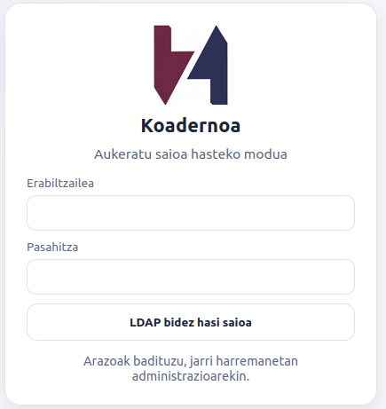
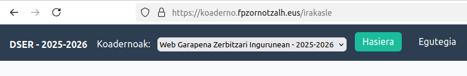
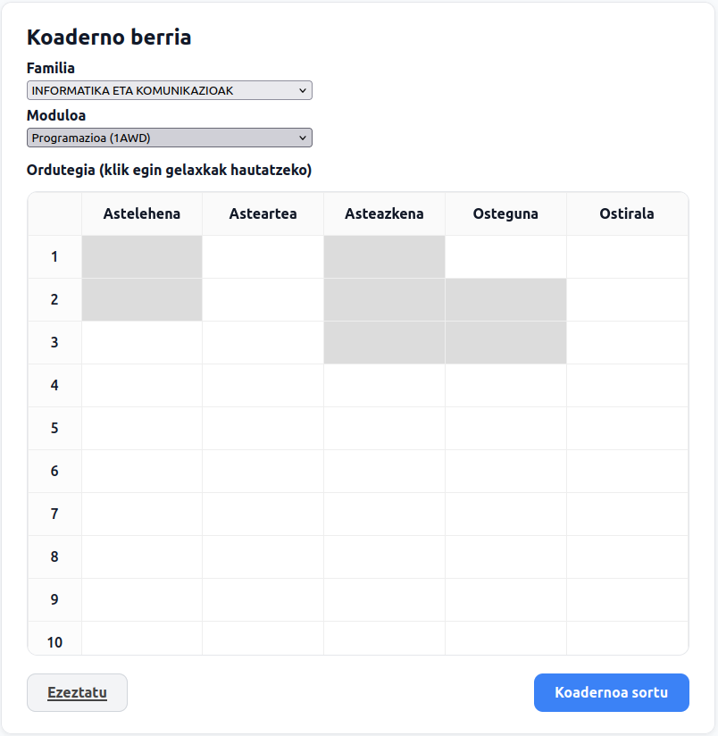
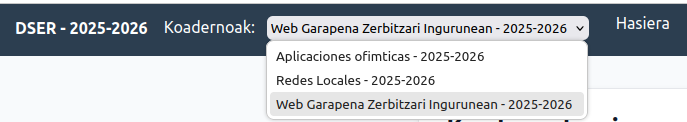
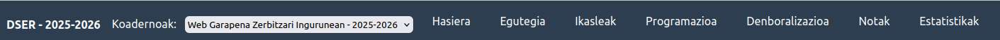
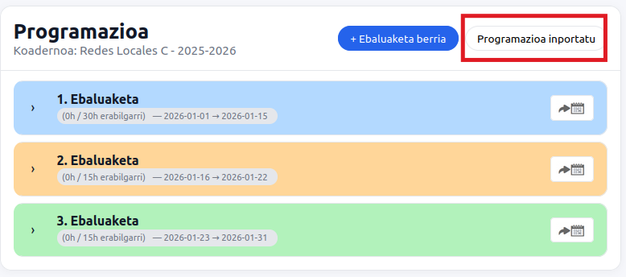
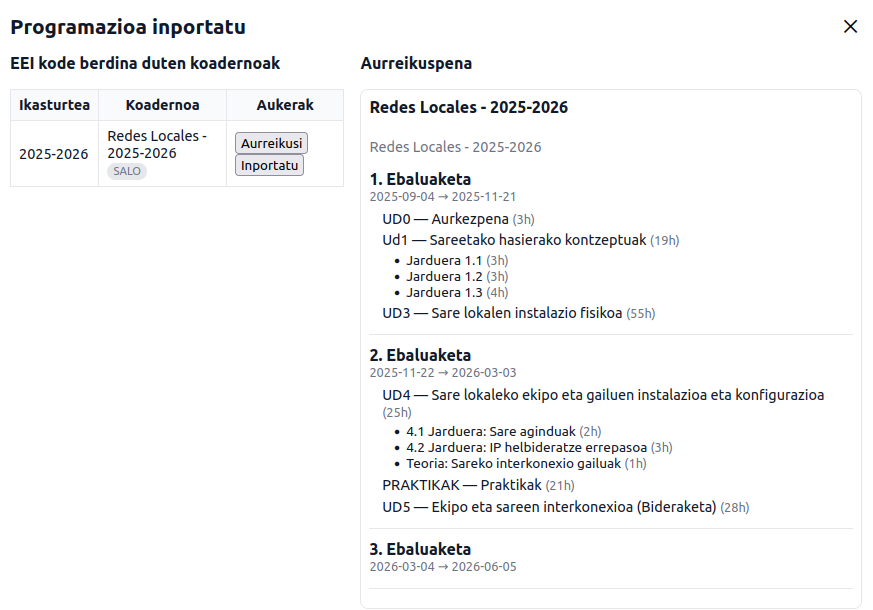
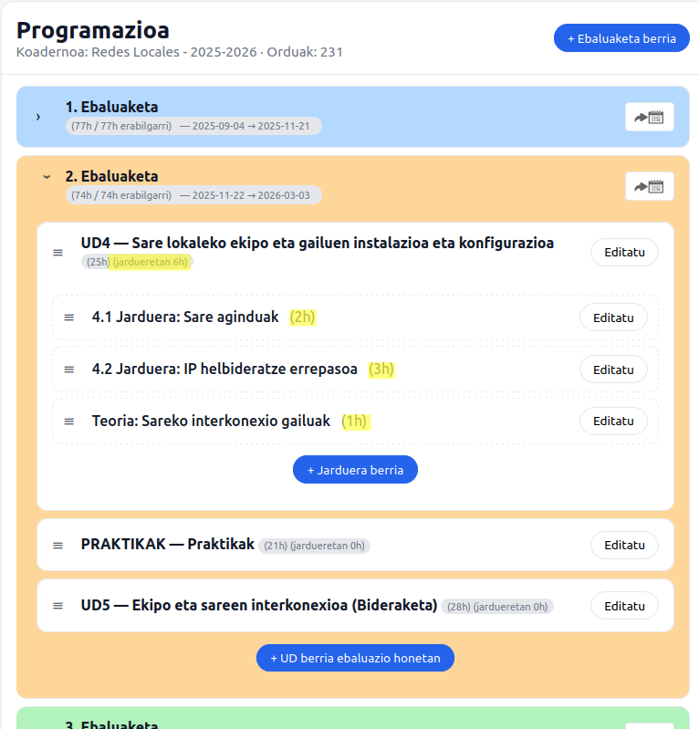
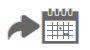
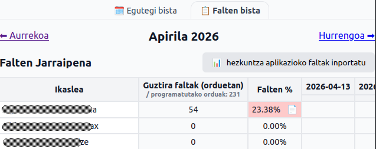

# Erabiltzaile gida

## Sarrera

Dokumentu hau **irakasle rola** duten erabiltzaileentzat da. Helburua da Koaderno Berria eguneroko lanean nola erabili azalpen praktiko eta argietan biltzea.

## 1. Saioa hasi

Aplikazioaren instalazioaren arabera, saioa hasteko bide hauek egon daitezke erabilgarri:

- Google bidezko saio-hasiera
- LDAP bidezko saio-hasiera

    

Ikastetxe bakoitzean aukera bat edo biak aktibo egon daitezke.

### Lehen aldia: mintegia aukeratu
Lehen aldiz sartzen zarenean, baliteke sistemak **mintegia / familia** aukeratzeko eskatzea. Urrats hori garrantzitsua da gero koaderno berriak sortzeko unean sistemak zure testuingurua hobeto ezagutzeko.

## 2. Irakaslearen hasierako orria

Irakaslearen hasierako orrian honako egoera hauetako bat aurkituko duzu:

- **Ez baduzu koadernorik**, sistemak koaderno berria sortzera gonbidatuko zaitu.
- **Koaderno aktiboa**. Koaderno bakarra baduzu, defektuz koaderno aktiboa izango da. Hainbat koaderno badituzu, koaderno aktibo bezala bat aukeratu dezakezu, honen gainean lan egiteko.

    

Kontuan hartu: Koaderno Berrian ***koaderno aktiboa*** kontzeptua garrantzitsua da. Erabiltzaileak une bakoitzean aukeratuta duen koadernoa da, eta atal askok horren gainean lan egiten dute. Edozein pantailatik aldatu daiteke koaderno aktiboa (adibidez, koaderno ezberdinetan jarritako notak kontsultatzeko).

## 3. Koaderno berria sortu

Koaderno berri bat sortzea da irakaslearen lehen lan arruntetako bat. Aplikazioan "**Hasiera**" orritik egin daiteke.

### Oro har, formularioan hau aukeratzen da:
- familia edo mintegia (defektuz zurea)
- modulua
- moduluaren ordutegia

    

Ordutegia lauki-sarea zuriz egongo da, aukeratzen ditugun gelaxkak ordu bateko balioa dute. Aurreko irudian adibidez Astelehenean lehen 2 orduetan klasea dagoela adierazten du (guk klikatu ditugu 2 gelaxka horiek). Aurrerago ere ordutegia aldatu al izango da, edota ordutegi berri bat sortu beste data batzuetarako.

### Gomendioak
- Ordutegia zehaztea komeni da, gero asistentzia eta denboralizazioa errazago lantzeko.

## 4. Koaderno aktiboa aldatu

Nabigazio barran dugun zabalgarrian aukeratu dezakegu koaderno aktiboa.

    

Irakasle batek koaderno bat baino gehiago izan ditzake. Horregatik, atal askotan lanean hasi aurretik komeni da egiaztatzea zein den **koaderno aktiboa**.

Koaderno aktiboa aldatzean:
- ikasleen zerrenda
- egutegia
- denboralizazioa
- notak
- eta estatistikak

hautatutako koadernoari dagozkionak izango dira.

## 5. Koaderno baten barruko oinarrizko atalak

    

### 5.1 Egutegia
Koaderno aktiboari lotutako egutegia kontsulta dezakezu. Egutegi hau, ikastetxeko kudeatzaileak aurretik definitu du. Berton ikus daitezke kolore ezberdinetan ebaluaketak, jarritako oharrak (adibidez ebaluazio saioak dauden) edo egun aldaketaren bat badago.

Egutegian 3 kolore bloke nagusi bereizten dira, ebaluaketei dagozkienak.
Egun bereziak ere egon daitezke, jaiegunak edota ez lektiboez gain, egun "ordezkatuak" ere existitzen dira.
Hauek, nahiz eta osteguna izan, adibidez ikastetxe mailan astearte gisa tratatu daitezke.

Egun batzuek puntu txikitxo bat daukate, horrek esan nahi du egun horretan informazio gehiago dagoela. Adibidez, ebaluazio bilerak daudela adierazteko.

Egun bakoitzaren gainean kokatuta, egun horri buruzko informazioa erakusten da.

### 5.2 Ikasleak
Koaderno bakoitzak bere ikasle-zerrenda du. Atal honetan:
- koadernoan dauden ikasleak kontsultatu ditzakezu
- ikasleen egoeraren jarraipena egin (ikasleren batek modulua gaindituta badauka jada adibidez)

Defektuz, koaderno bat sortzean ikasle zerrenda agertuko da, baina baliteke "ikasleak inportatu" botoia agertzea ere bai, kasu berezietan.

### 5.3 Programazioa
Programazio atalean jada ebaluaketak eta hauetan moduluak dituen orduak kalkulatuta egongo dira zuzenean (ordutegia eta egutegia baliatu ditu honetarako).

Hauek egin daitezke:

- beste koaderno bateko programazioa erabili (irakasgai bereko aurreko urtekoa, edo aurtengo beste hizkuntza batean sortutako programazioa). Aukera hau soilik programazioa hutsik badago erakusten da.

    

Behin "Programazioa inportatu" aukeratuta zabalduko den leihoa:

    

Aurreko leihoan programazioak Aurreikusi eta Inportatu egin daitezke.
Gero programazioa aldatzeko aukera egongo da.

- aurreko urteko koadernoko denboralizaziotik programazioa sortu
- erronkak, unitatea didaktikoak eta jarduerak zehaztu

    

Ebaluaketen hasiera-bukaera datak eta moduluak dituen orduak zuzenean kalkulatzen ditu, egutegia eta ordutegia kontuan hartuta. 
  
Unitateetan jarduerak zehaztu daitezke edo ez. Aurreko adibidean UD4an 3 jarduera sortu dira. Nahiz eta UD4ak 25 ordu izan, 6 ordura arteko jarduerak sortu ditugu, baina gero denboralizaziora bolkatzean, UD horren lehen 6 orduak jarduerekin beteko ditu, eta gainontzeko 19 orduetarako UDaren izena duen jarduerak sortuko ditu.  

- programatutakoa denboralizaziora irauli (egunerokoa sortu). Ebaluaketaka irauli daiteke edo programazio osoa.

    

### 5.4 Denboralizazioa
Denboralizazioan 2 bista nagusi ditugu:
 - Hilabete bistan, jardueren planifikazioa
 - Falten bistan, ikasleen hutsegiteen zerrenda

Denboralizazioa hilabetekako ikuspegi bisuala ematen duen atala da. Programaziotik ebaluaketak "bolkatu" baditugu, automatikoki sortuta egongo da. Bertan:
- saioak edo jarduerak kokatu edota birplanifikatu
- egutegiko muga errealak kontuan hartu, ebaluaketak koloreekin bereiztuz

### 5.5 Ikasleen bertaratzea
Asistentzia atalean ikasleen bertaratzea erregistratzen da:
- hutsegiteak
- hutsegite justifikatuak
- berandutzeak

Nahiz eta komeni den jarraipen hau egunean-egunean egiten joatea, aukera dago Hezkuntzako aplikaziotik deskargatutako "Hutsegiteen txostena" inportatzea.

Ikasleen hutsegiteak irakasgaiaren orduen %20 gainditzen badu, **ebaluazio jarraituko eskubidea galdu izanaren txostena** sortu daiteke.

    

### 5.6 Notak
Noten atalean ebaluazioari lotutako informazioa jasotzen da. Atal honetan:
- kalifikazioak sartu,
- ikasle edo jarduera mailako emaitzak kontsultatu,
- eta ebaluazioarekin lotutako datuak eguneratu

daitezke.

### 5.7 Estatistikak
Estatistikak atalak koadernoaren ikuspegi sintetikoa ematen du. Helburua ez da datuak eskuz milaka aldiz kalkulatzea, baizik eta koadernoaren egoeraren laburpena edukitzea:
- saio kopuruak,
- gaindituen egoera,
- bertaratzearekin lotutako balioak,
- edo ebaluazio amaierako ikuspegiak.

## 6. Koadernoa partekatu

Koaderno bat irakasle batek baino gehiagok erabili dezake. Horretarako, aplikazioak koadernoa partekatzeko aukera eskaintzen du.

### Zertarako da erabilgarria?
- modulu partekatuetan,
- ordezkapenetan,
- talde-lanean,
- edo tutoretza/koordinazio egoeretan.

### Gomendioak
- Partekatzea egin aurretik, argi izan nor arduratuko den atal bakoitzaz.
- Koaderno partekatuetan, komeni da irizpide minimo batzuk adostea: izendegiak, noten politika, asistentziaren erregistroa eta abarrak.

## 7. Koaderno bat utzi edo bertatik irten

Irakasle batek koaderno batean parte hartzeari utzi diezaioke, baina sistemak normalean ez du uzten koadernoa **irakaslerik gabe** uzten.

Horregatik:
- koaderno batean azken irakaslea bazara, ezin izango duzu utzi beste norbait geratu gabe.
- irten aurretik, ziurtatu beste erabiltzaile arduradun bat dagoela.

## 8. Koaderno bateko irakasleak kendu

Irakasle-zerrendaren kudeaketan, koaderno bateko irakasle bat kentzea administrazio handiagoko baimenekin lotuta egon ohi da. Ohiko jardunean:
- partekatzea egin dezakezu,
- baina kentze-eragiketek kontrol handiagoa izan dezakete.

## 9. Koadernoa ezabatu

Koaderno bat ezabatzea ekintza sentikorra da. Horregatik, sistemak normalean berrespen esplizitua eskatzen du, adibidez:
- koadernoaren izena berriz idaztea,
- eta ikasturtearen izena baieztatzea.

Ezabatu aurretik:
- egiaztatu benetan koadernoa zaharkituta edo desegokia dela,
- eta ziurtatu ez dagoela informazio baliagarririk galduko.

## 10. Ohiko lan-fluxu gomendatua

Irakasle askorentzat ondoko sekuentzia hau da praktikoena:

1. Saioa hasi.
2. Behar denean, koaderno aktiboa aukeratu.
3. Koaderno berria sortu edo lehendik dagoen bat ireki.
4. Ikasleak sinkronizatu.
5. Ordutegia eta egutegia berrikusi.
6. Programazioa eta denboralizazioa landu.
7. Egunerokoan asistentzia eta jarduerak erregistratu.
8. Ebaluazio uneetan notak eta estatistikak osatu.

## 11. Erroreak edo egoera arruntak

### “Ez dago koaderno aktiborik”
Normalean esan nahi du:
- ez duzula koadernorik sortu,
- edo ez duzula une horretan koaderno aktiborik hautatu.

### “Ezin da ekintza hau egin”
Baliteke arrazoia hauetako bat izatea:
- koaderno horretarako baimenik ez izatea,
- koadernoa ez existitzea,
- edo koadernoaren egoerak ekintza hori blokeatzea.

### Ikasleak falta dira
Sinkronizazioa edo inportazioa berrikusi. Koaderno berrietan, sarritan beharrezkoa da taldetik ikasleak ekartzea.

## 12. Erabilera onaren gomendioak

- Eguneroko erregistroak ez utzi ebaluazio amaierara arte.
- Koaderno aktiboa egiaztatu datuak sartu aurretik.
- Partekatutako koadernoetan, adostu lan egiteko irizpide bateratuak.
- Ez ezabatu koadernoak premiaz; lehenago baloratu artxibatzeko edo mantentzeko beharra.
- Estatistikak informazio lagungarri gisa erabili, baina beti testuinguru pedagogikoarekin batera interpretatu.

## 13. Laburpena

Irakaslearentzat, Koaderno Berria da:
- koaderno digitala,
- eguneroko lanaren antolaketa tresna,
- ikasleen jarraipen sistema,
- eta ebaluazioari lotutako lanaren euskarri nagusia.

Erabilera eraginkorrenak koaderno aktiboa, egutegia, ikasleak, asistentzia, programazioa, notak eta estatistikak modu koherentean uztartzen ditu.
